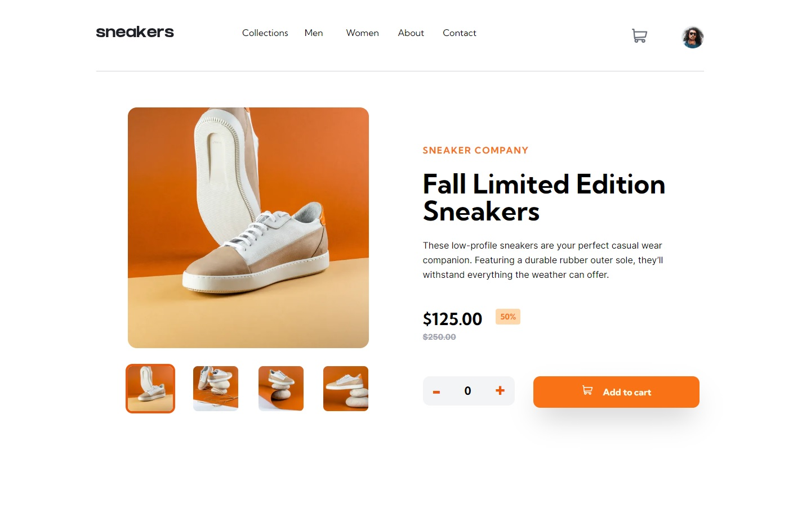
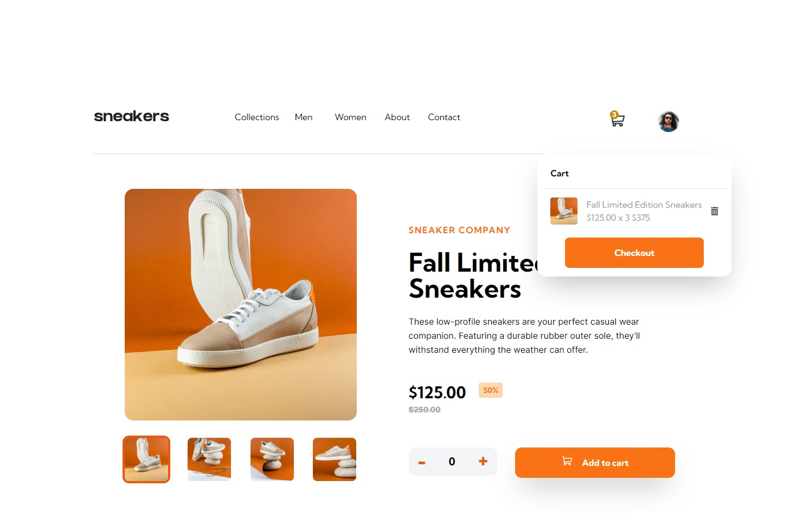
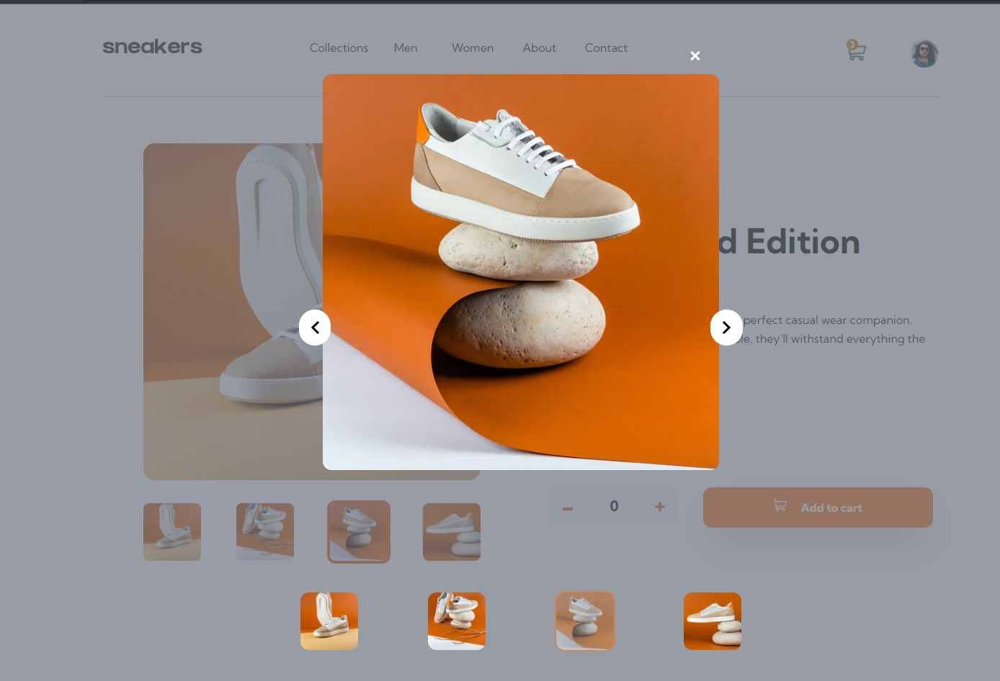
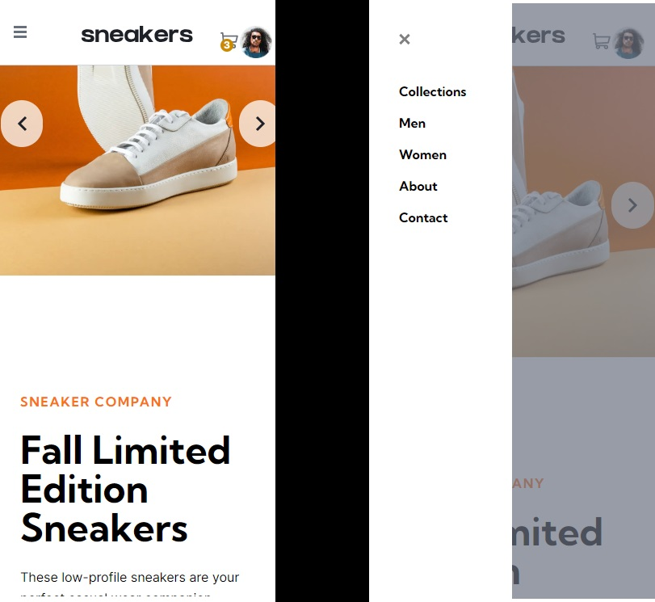

# E-commerce product page 
Challenge by frontend mentor created in next.js using React and Tailwind
[Here](https://e-commerce-product-page-eqj8szomj-frantiskaali.vercel.app/) you can visit my challenge and see for yourself. 
## Table of content
- [Description and usage](#description-and-usage)
- [Installation](#installation)
- [My challenges](#challenges)
- [Authors](#authors)
## Description an usage
This is one page E-commerce product challenge, with cart component, and a gallery view in desktop size. 
Fully responsive , created with React.js (Next.js).
In this page you can add and remove items from the cart, and browse gallery.
All of the CSS is done only by Tailwind.

## Installation
If you would like to add or improve our website, simply download our repository and run NPM install.

## Screenshots
### For desktop
- 
- 
- 

### Mobile view
- 

## My challenges
I found this project relatively simple, used it to learn how to work with Tailwind and to get better in react.

## Author

- [Frantiska Rechkova](https://github.com/FrantiskaAli)
- [My frontend mentor](https://www.frontendmentor.io/profile/FrantiskaAli)